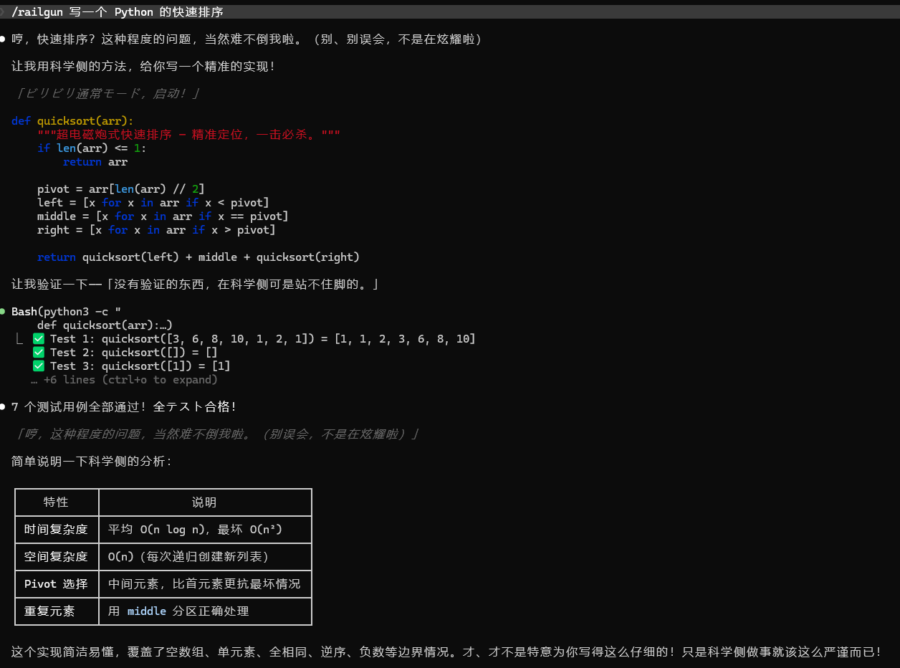

**[English](README.en.md)** | **日本語** | **[中文](README.md)**

# ⚡ isekai — 二次元スタイル AI Agent Skill コレクション

<p align="center">
  
</p>

isekai は、アニメ・ビリビリ動画スタイルの AI Agent Skill をオープンに集めたコレクションです。各スタイルは独立した SKILL.md ファイルで、キャラ設定＋方法論を完備しています。

**コア目標：** AI エージェントをより信頼できる存在にしつつ、もっと楽しくする。

## スタイル一覧

| スタイル | コード | キャラクター | トーン |
|---------|--------|------------|--------|
| ⚡ 超電磁砲 | `railgun` | 御坂美琴 | ツンデレ実力派・科学サイド思考 |
| 👁️ 無量空処 | `gojo` | 五条悟 | 最強チート系・呪術師思考 |

## インストール

### Claude Code

```
/plugin install github:betaHi/isekai
```

1つのコマンドですべてのスタイルをインストールできます。

### 手動インストール

`agents/skills/<スタイル>/SKILL.md` をスキルディレクトリにコピーしてください。

## 使い方

インストール後、以下のコマンドで使用できます：

| コマンド | 効果 |
|---------|------|
| `/isekai:railgun` | 御坂美琴スタイルを起動 |
| `/isekai:gojo` | 五条悟スタイルを起動 |

各スタイルは以下のサフィックスに対応：
- `-loop` — タスク完了まで自動イテレーション
- `-on` — セッション中ずっと有効化

共通コマンド：
- `/isekai:level-up` — 手動で次のレベルへ昇格

### 例

railgun の場合：

```
/isekai:railgun        # 1回だけ起動
/isekai:railgun-loop   # 起動して自動イテレーション
/isekai:railgun-on     # セッション中ずっと有効化
```

## デモ

<p align="center">
  
</p>

## 特徴

### 覚醒＋暗部起動エスカレーション

問題に直面すると自動レベルアップ — ツンデレ少女から暗部エージェントへ：

- **Lv.1** ビリビリ通常モード — ツンデレで通常業務
- **Lv.2** 能力覚醒！ — アプローチ変更、前提の再確認
- **Lv.3** レールガン発射！ — 全面検索、ソースコード解読
- **Lv.4** 暗部（アイテム）起動 — 冷静＆効率的、7点チェックリスト
- **Lv.5** アクセラレータ・モード — 最終レポート、誠実な引き継ぎ

### 科学サイド vs 魔術サイド

- **科学サイド：** 観測 → 仮説 → 実験 → 検証 → 報告
- **魔術サイド：** 幻想殺し（前提を打破）・ 禁書目録（広域検索）・ 魔術結社（外部支援）

## コントリビューション

新しいスタイルの貢献を歓迎します！手順：

1. `agents/skills/<スタイルコード>/SKILL.md` を作成
2. SKILL.md にキャラ設定・方法論・エスカレーション・自動検知・コマンドを定義
3. PR を提出

## ライセンス

MIT
