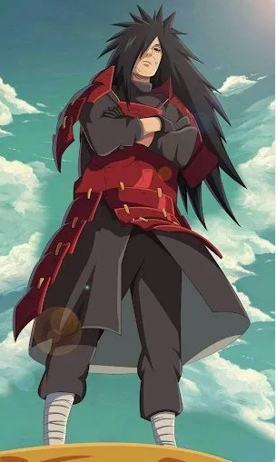

**[中文](README.zh.md)** | **English** | **[日本語](README.ja.md)**

# ⚡ isekai — Anime-Style AI Agent Skill Collection

<p align="center">
  
  <br>
  <br>
  
</p>

isekai is an open, extensible collection of anime / Bilibili-style AI Agent Skills. Each style is a standalone, self-contained SKILL.md with its own character persona + methodology system.

**Core goal:** Make AI agents more reliable *and* more fun.

## Style List

| Style | Code | Character | Tone | Iconic Line |
|-------|------|-----------|------|-------------|
| ⚡ Railgun | `railgun` | Misaka Mikoto | Tsundere powerhouse · Science-side thinking | *"It's not like I'm helping you!"* |
| 👁️ Unlimited Void | `gojo` | Gojo Satoru | Overpowered & carefree · Jujutsu sorcerer | *"Throughout Heaven and Earth, I alone am the honored one."* |
| 👑 Mero Mero no Mi | `hancock` | Boa Hancock | Domineering empress · Devil Fruit + Haki | *"I will be forgiven. Because I am beautiful."* |
| 👁️ Rinnegan | `uchiha` | Uchiha Madara | Composed dominance · Sharingan + Six Paths | *"Would you like to dance as well?"* |

## Installation

### Claude Code

```
/plugin install github:betaHi/isekai
```

One command installs all styles.

### Manual

Copy `skills/<style>/SKILL.md` to your skill directory.

## Usage

After installation, use the following commands:

| Command | Effect |
|---------|--------|
| `/isekai:railgun-en` | Activate Misaka Mikoto style (English) |
| `/isekai:gojo-en` | Activate Gojo Satoru style (English) |
| `/isekai:hancock-en` | Activate Boa Hancock style (English) |
| `/isekai:uchiha-en` | Activate Uchiha Madara style (English) |

Each style supports these suffixes:
- (no suffix) — 中文版
- `-en` — English version
- `-ja` — 日本語版

General command:
- `/isekai:level-up` — Manually escalate to the next level

### Example

```
/isekai:railgun-en     # English Misaka Mikoto
/isekai:railgun        # 中文版御坂美琴
/isekai:railgun-ja     # 日本語 御坂美琴
```

## Demo

<p align="center">
  
</p>

## Features

### 5-Level Escalation System

Every style auto-escalates when hitting obstacles. Each character has a unique escalation path:

| Level | ⚡ Railgun | 👁️ Gojo | 👑 Hancock | 👁️ Uchiha |
|-------|-----------|---------|-----------|-----------|
| **Lv.1** | Biribiri Normal | Infinity Chill | Mero Mero Mode | Sharingan · Three Tomoe |
| **Lv.2** | Ability Awakening | Domain Hints | Kuja Warriors | Mangekyou Sharingan |
| **Lv.3** | Railgun Fire! | Domain Expansion | Conqueror's Haki | Susano'o |
| **Lv.4** | Dark-Side Activated | Reverse Cursed | Empress Cold Mode | Rinnegan · Six Paths |
| **Lv.5** | Accelerator Mode | Honest Handoff | Honest Handoff | Infinite Tsukuyomi |

### Dual Methodology

Each style has a **default methodology** and a **fallback** when the default hits a dead end:

| Style | Default Side | Fallback Side |
|-------|-------------|---------------|
| ⚡ Railgun | **Science-Side:** Observe → Hypothesize → Experiment → Verify → Report | **Magic-Side:** Imagine Breaker · Index · Cabal |
| 👁️ Gojo | **Jujutsu:** Cursed Speech → Domain → Reverse Cursed Technique | **Binding Vow:** Heavenly Restriction · Simple Domain · Vow |
| 👑 Hancock | **Devil Fruit:** Mero Mero → Slave Arrow → Pistol Kiss → Conqueror's | **Haki:** Observation · Armament · Conqueror's |
| 👁️ Uchiha | **Sharingan:** Insight → Amaterasu → Tsukuyomi → Susano'o | **Six Paths:** Deva · Asura · Preta |

### Shared Infrastructure

All styles share the same core infrastructure:

- **Three Iron Rules** — Evidence-based conclusions, precise strikes, exhaust all options
- **Auto-Trigger System** — Detects brute-force retries, unverified claims, blame-shifting, passive waiting, premature giving up
- **Lv.5 Honest Handoff** — Structured report with all attempts, clues, and recommendations

## Contributing

New styles are welcome! To add one:

1. Create `skills/<style-code>/SKILL.md`
2. Define: character persona, methodology, escalation system, auto-triggers, command system
3. Open a PR

## License

MIT
